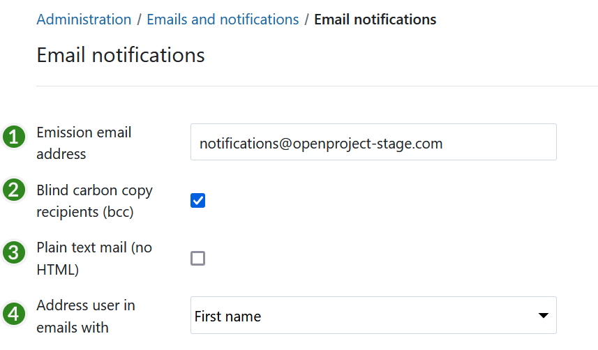
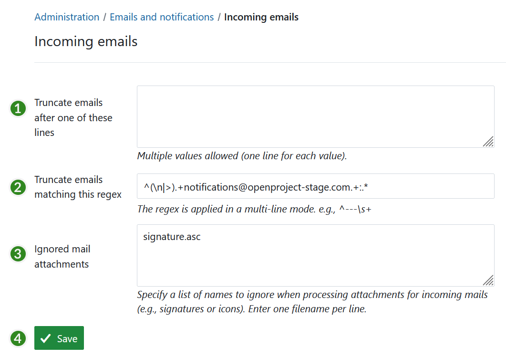

---
sidebar_navigation:
  title: Emails and notifications
  priority: 910
description: manage notifications and emails.
keywords: incoming and outgoing notifications emails
---
# Emails and notifications

Configure **Emails and notifications settings** in OpenProject, i.e. email notifications and incoming email configuration.

Navigate to **Administration → Emails and notifications**.

| Topic                                                | Content                                                      |
| ---------------------------------------------------- | ------------------------------------------------------------ |
| [Aggregation](#aggregation)                          | Configure how individual actions are aggregated into a single action. |
| [Email notifications](#email-notifications-settings) | How to configure outgoing email notifications.               |
| [Incoming emails](#incoming-emails-settings)         | How to configure settings for inbound emails.                |

## Aggregation

The setting **User actions aggregated within** specifies a time interval in which all notifications regarding a specific user's actions are bundled into one single notification. Individual actions of a user (e.g. updating a work package twice) are aggregated into a single action if their age difference is less than the specified time span. They will be displayed as a single action within the application. This will also delay notifications by the same amount of time reducing the number of emails being sent.

## Email notifications settings

1. **Emission email address**. This email address will be shown as the sender for the email notifications sent by OpenProject (for example, when a work package is changed).
2. Activate **blind carbon copy recipients** (bcc).
3. Define if the email should be formatted in **plain text** (no HTML).
4. Define if the users in emails should be **addressed with their first names or full names**.

The frequency of sending e-mails per work package can be set [here](../calendars-and-dates/#date-format).

### Configure email header and email footer

Configure your notification email header and footer which will be sent out for email notifications from the system.

1. **Formulate header and/or footer** for the email notifications. These are used for all the email notifications from OpenProject (e.g. when creating a work package).
2. **Choose a language** for which the email header and footer will apply.
3. **Send a test email**. Please note: This test email does *not* test the notifications for work package changes etc. Find out more in [this FAQ](../../installation-and-operations/installation-faq/#i-dont-receive-emails-test-email-works-fine-but-not-the-one-for-work-package-updates-what-can-i-do).
4. Do not forget to **save** your changes.

## Incoming emails settings

To configure **Incoming emails** in OpenProject, navigate to **Administration → Emails and notifications → Incoming emails**. You can adjust the following:

1. **Define after which lines an email should be truncated**. This setting allows shortening email after the entered lines.
2. Specify a **regular expression** to truncate emails.
3. **Ignore mail attachment** of the specified names in this list.
4. Do not forget to **save** the changes.

**To set up incoming email**, please visit our [Operations guide](../../installation-and-operations/configuration/incoming-emails).

**To configure individual email reminders**, please visit our [User guide](../../getting-started/my-account/#email-reminders).
